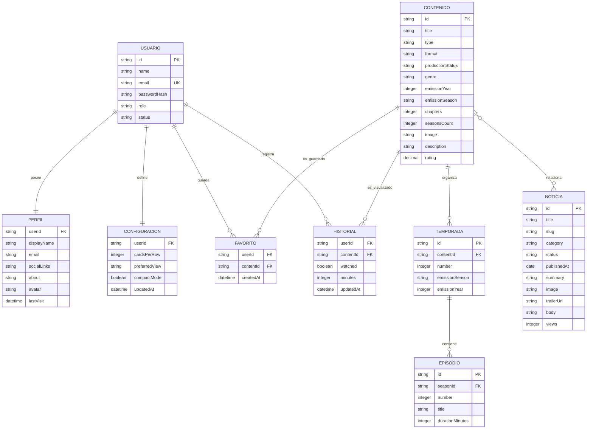

# Modelo de persistencia PHP y JSON - Altoidss

Este diagrama representa la arquitectura de datos final del proyecto. PHP gestiona los archivos JSON, valida las solicitudes, controla los permisos y crea respaldos antes de cada escritura.

## Archivos principales

- `usuarios.json`: credenciales cifradas, rol y estado de cada cuenta.
- `perfiles.json`: información pública y preferencias personales.
- `configuraciones.json`: opciones de visualización del catálogo.
- `peliculas.json`, `series.json` y `anime.json`: catálogo audiovisual.
- `favoritos.json`: relación entre usuarios y contenido guardado.
- `historial.json`: estado visto y minutos de visualización.
- `noticias.json`: publicaciones editoriales y enlaces multimedia.
- `temporadas.json` y `episodios.json`: estructura preparada para el detalle episódico.

## Diagrama lógico

## Funcionamiento

Los archivos separados se comportan como colecciones relacionadas mediante identificadores. `userId` vincula usuarios con perfil, configuración, favoritos e historial. `contentId` enlaza favoritos e historial con un registro almacenado en películas, series o anime.

Las sesiones activas se administran con sesiones PHP dentro de `backups/sessions`; no se exponen como un archivo público de datos. `JsonStorage` utiliza bloqueo exclusivo durante las escrituras y conserva copias automáticas en `backups`.

Temporadas y episodios forman parte del modelo preparado, aunque sus archivos pueden permanecer vacíos mientras no se cargue detalle episódico. Las noticias relacionan contenido por título y pueden guardar un tráiler oficial de YouTube validado por el backend.
